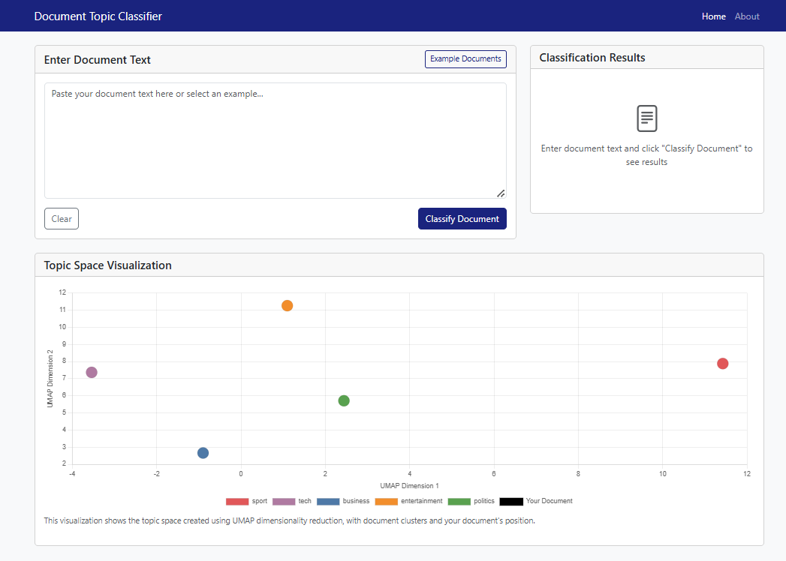
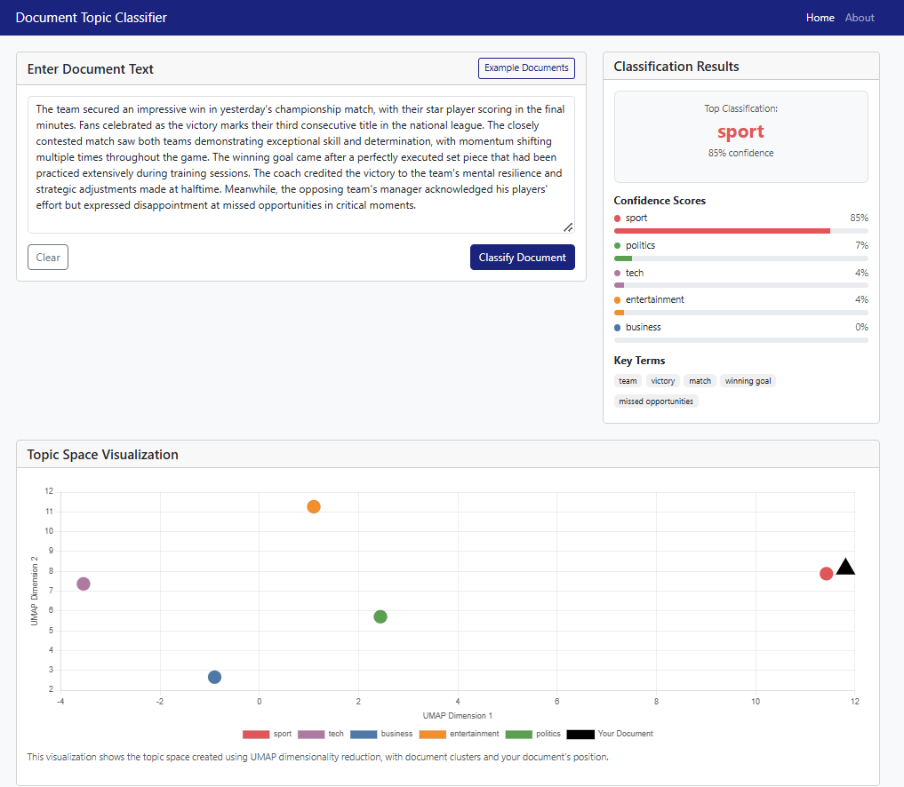

# Document Topic Modeling Framework


A comprehensive framework for unsupervised topic modeling and document classification using transformer-based embeddings. This project includes both the research notebooks for model development and a complete interactive web application.

## Project Overview

This project combines modern natural language processing techniques to discover latent topics in text documents without manual labeling:

- **Transformer Embeddings**: Leverage RoBERTa to generate high-quality document representations
- **Dimensionality Reduction**: Apply UMAP to preserve semantic relationships while reducing dimensions
- **Clustering**: Implement K-means clustering to discover natural topic groups
- **Interactive Visualization**: Explore document-topic relationships through interactive visualizations

The implementation is provided both as research notebooks and as a production-ready web application.

## Repository Structure
```
└─── Notebooks/
│    │    Advanced_Topic_Modeling.ipynb
│    │    Transformers_Embedding_Benchmark.ipynb
└─── application
│    └─── static/
│    └─── templates/
│    └─── topic_model_export/
│    │    app.py
│    │    requirements.txt
│    README.md
```

## Research Notebooks

### Advanced_Topic_Modeling.ipynb

This main notebook implements a comprehensive framework for unsupervised topic modeling using transformer-based embeddings, tested on the BBC News Dataset (2,225 documents across 5 categories):

1. **Data Understanding & Preprocessing**: Thorough exploration of the BBC News dataset including category distribution, document length analysis, and word frequency analysis.
2. **Embedding Pipeline**: Implementation of RoBERTa embeddings for document representation, with methods to handle document length constraints.
3. **Dimensionality Reduction**: Comparison of PCA, t-SNE, and UMAP techniques, with UMAP providing the best performance.
4. **Clustering Implementation**: K-means and hierarchical clustering algorithms with evaluation metrics like ARI, homogeneity, and silhouette scores.
5. **Topic Extraction & Labeling**: Methods to automatically extract distinctive terms and generate meaningful topic labels for each cluster.
6. **Visualization Tools**: Creation of various visualizations including topic proximity maps, document-topic distributions, and interactive visualizations.

### Transformers_Embedding_Benchmark.ipynb

This notebook focuses on benchmarking different transformer models and embedding techniques to identify the optimal configuration:

1. **Model Comparison**: Evaluation of 5 transformer models (BERT, RoBERTa, DistilBERT, MPNet, and ALBERT) with the same BBC News dataset.
2. **Embedding Method Assessment**: Comparison of two embedding approaches - CLS token (using the classification token) and Mean token (averaging all token embeddings).
3. **Performance Metrics**: Thorough evaluation using clustering quality metrics (ARI, Homogeneity, V-measure, Silhouette score) and processing efficiency.
4. **Results Analysis**: Detailed visualizations and comparisons of model performance, with recommendations for the optimal configuration.
5. **Recommendations**: Clear conclusions about which model and embedding method perform best for topic modeling tasks.

## Web Application

The `/application` folder contains a production-ready Flask web application that implements the topic modeling framework with an intuitive user interface.

### Application Overview

This application uses advanced natural language processing techniques to automatically classify text documents into topics without requiring any manual labeling. The system combines several state-of-the-art machine learning components:

#### Technical Architecture

- **RoBERTa Embeddings**: A state-of-the-art transformer model that converts text into high-dimensional semantic representations (768 dimensions)
- **UMAP Dimensionality Reduction**: Reduces the high-dimensional embeddings to a manageable space while preserving important semantic relationships
- **K-means Clustering**: Groups documents with similar meanings into distinct topic

#### Classification Process

1. **Document Embedding**: When you input a document, the system generates a RoBERTa embedding that captures its semantic meaning
2. **Dimensional Projection**: This embedding is then projected into the same space as pre-trained topic clusters using UMAP
3. **Proximity Analysis**: The system calculates the proximity to each topic cluster and assigns confidence scores
4. **Topic Assignment**: The document is classified into the most likely topic, with confidence scores shown for all categories
5. **Key Term Extraction**: Distinctive terms from the document are identified and displayed to explain classification reasoning

### Features

- **Text Input Options**: Paste text directly or select from example documents
- **Real-time Classification**: Process documents instantly and see results without page refresh
- **Confidence Analysis**: View probability distribution across all potential topics
- **Document-specific Key Terms**: Extract and highlight distinctive terms from the input document
- **Interactive Visualization**: Explore how the document positions in relation to topic clusters in 2D space
- **Responsive Design**: Works seamlessly on desktop and mobile devices

### Screenshots




## Getting Started

### Prerequisites

- Python 3.7+
- Required libraries listed in `requirements.txt`

### Installation

1. Clone the repository:
```bash
git clone https://github.com/imanerh/Topic-Modeling.git
cd Topic-Modeling
```

2. Install required packages:
```bash
pip install -r requirements.txt
```

### Running the Web Application

1. Navigate to the application directory:
```bash
cd application
```

2. Run the Flask app:
```bash
python app.py
```

3. Open your browser and go to:
```bash
http://localhost:5000
```

### Results
The framework achieves excellent topic separation on the BBC News dataset:
- **High Clustering Metrics**: **0.85+** homogeneity and V-measure scores
- **Strong Category Alignment**: **90%+** alignment with ground truth categories
- **Interpretable Topics**: Clear and distinctive terms characterizing each topic
